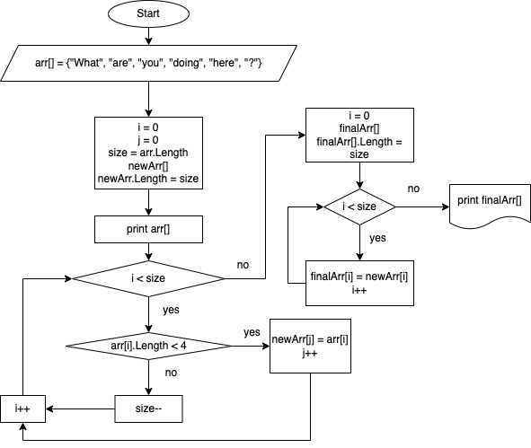

# Итоговая проверочная работа
**Задача:** _Написать программу, которая из имеющегося массива строк формирует массив строк, длинна которых меньше, либо равна 3 символам._

## Примеры:

* ["Hello", "132", "World", "D7"] -> ["132", "D7"]
* ["1265437", "who", "is", "here", "..."] -> ["who", "is", "..."]
* ["12", "обезьян", "это", "=", "полтора", "землекопа", "?"] -> ["12", "это", "=", "?"]

## Блок-схема решения задачи:

 

## Алгоритм решения задачи:

Файл *Program.cs* содержит код, определяющий алгоритм решения поставленной задачи и включает в себя 3 метода:

1. PrintArray
2. FindLngthOfString
3. Test1

Стр. 1 - 9 содержат метод *PrintArray*, позволяющий выводить строки массива на консоль. 

Стр. 11 - 19 содержат метод *FindLngthOfString*, позволяющий определить длинну указанной строки.

Оба вышеописанных элемента кода вынесены в отдельные методы ввиду их неоднократного использования в теле задачи, описанном методом *Test1*.

Итак, имеем заданный строковый массив определенной длинны (Стр. 23).

Пользуясь методом *PrintArray*, выводим содержимое массива на консоль (Стр. 24).

В Стр 25, 26 определяем переменную *size*, равную длинне исходного массива, и переменную *j*, необходимую нам в дальнейшем цикле.

В Стр. 27 определяем новый пустой строковый массив, равный по длине исходному.

Затем организуем цикл записи строк исходного массива, длинна которых не превышает 3х элементов в новый массив (Стр. 28 - 36), попутно уменьшая значение *size* на количество строк исходного массива, длинна которых строго больше 3. Последняя процедура необходима для определения длинны финального (искомого) массива.

Стр. 37: определяем пустой финальный строковый массив с длинной равной измененному значению *size*.

Затем производим запись всех непустых элементов нового массива в финальный (Стр. 38 - 41).

Итогом задачи является вывод финального массива, содержащего строки исходного массива, длинна которых меньше либо равна 3 (Стр. 42).

